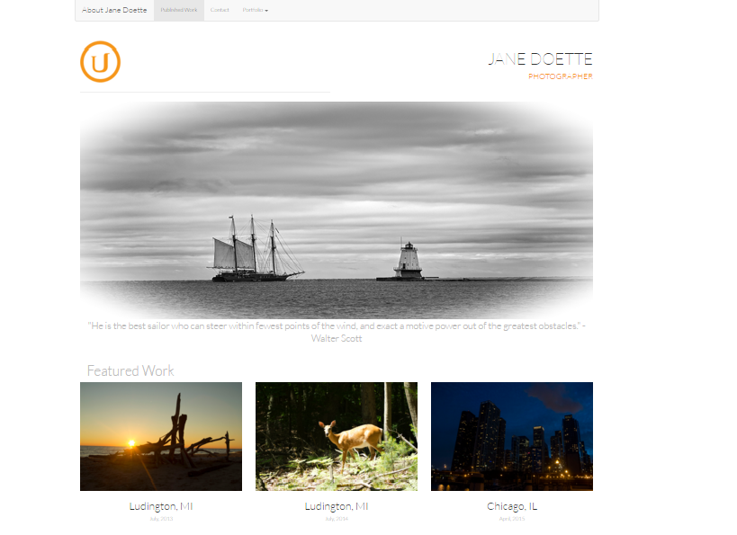

# Portfolio Mock Up

###### Udacity Description
You will be provided with a design mockup as a PDF-file and must replicate that design in HTML and CSS. You will develop a responsive website that will display images, descriptions and links to each of the portfolio projects you will complete throughout the course of the Front-End Web Developer Nanodegree.

[Live Site](http://cshields88.github.io/Udacity-FEND-Portfolio-Mock-Up)

